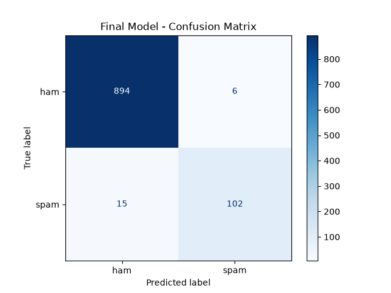

# 📩 SMS Spam Detector
live demo!!
https://spam-detector-6vr22ygmfacvwx2vfsnfys.streamlit.app/
A machine learning project that classifies SMS messages as **Spam** or **Ham (Not Spam)** using TF-IDF features and classical machine learning models, with a Streamlit web application for real-time predictions.

**Status: Completed ✅**

---

## 🎯 Problem Statement

Spam messages can waste time and may contain unwanted advertisements, scams, or misleading content.

The goal of this project is to build a machine learning system that can automatically classify SMS messages as:

- 🟢 **Ham** — legitimate message
- 🔴 **Spam** — unwanted or promotional message

The trained model is integrated into a Streamlit web application where users can enter a message and receive a prediction.

---

## 📊 Dataset

The project uses the **SMS Spam Collection** dataset.

- Total messages: **5,572**
- Ham messages: **4,825**
- Spam messages: **747**
- The dataset contains more ham messages than spam messages, making it an imbalanced classification problem.
- After cleaning and removing duplicate cleaned messages, **5,084 messages** remained.

---

## 🛠️ Tech Stack

- Python
- Pandas
- NumPy
- Scikit-learn
- TF-IDF
- Naive Bayes
- Logistic Regression
- Linear SVM
- GridSearchCV
- Joblib
- Streamlit
- Jupyter Notebook

---

## 🔍 Project Approach

### 1. Data Cleaning

The SMS messages were cleaned by:

- Converting text to lowercase
- Removing unnecessary punctuation and characters
- Removing duplicate cleaned messages

### 2. Feature Extraction

**TF-IDF (Term Frequency–Inverse Document Frequency)** was used to convert text messages into numerical features that machine learning models can understand.

The final tuned model used:

- Maximum features: **5,000**
- N-gram range: **(1, 2)**

This means the model considered both individual words and pairs of words.

### 3. Model Comparison

Three machine learning models were compared:

1. Multinomial Naive Bayes
2. Logistic Regression
3. Linear Support Vector Machine (SVM)

### 4. Evaluation

The models were evaluated using:

- Accuracy
- Precision
- Recall
- F1-score
- Confusion Matrix
- 5-fold Cross-Validation

F1-score was given importance because the dataset is imbalanced and both false positives and false negatives matter in spam detection.

### 5. Hyperparameter Tuning

GridSearchCV was used to tune the Linear SVM model.

The best parameters found were:

```text
C = 10
TF-IDF max_features = 5000
TF-IDF ngram_range = (1, 2)
```

Best cross-validation F1-score:

**0.922**

---

## 📈 Model Comparison Results

The following results were obtained on the test set:

| Model | Accuracy | Precision (Spam) | Recall (Spam) | F1 (Spam) |
|---|---:|---:|---:|---:|
| Naive Bayes | 96.95% | 100.00% | 73.50% | 84.73% |
| Logistic Regression | 97.25% | 87.39% | 88.89% | 88.14% |
| Linear SVM | 97.84% | 92.79% | 88.03% | 90.35% |

The Linear SVM achieved an F1-score of **90.35%** on the test set among the three initial models.

After hyperparameter tuning, the best cross-validation F1-score increased to **0.922**.

---

## 🔄 Cross-Validation Results

5-fold stratified cross-validation was used to check model stability.

| Model | CV F1 Mean | CV F1 Std |
|---|---:|---:|
| Naive Bayes | 0.8673 | 0.0313 |
| Logistic Regression | 0.9038 | 0.0102 |
| Linear SVM | 0.9081 | 0.0093 |

The small standard deviation values indicate that the models produced relatively consistent results across the different validation splits.

---

## 🧩 Final Model Confusion Matrix

The tuned final model produced the following confusion matrix on the test set:

| Actual / Predicted | Ham | Spam |
|---|---:|---:|
| **Ham** | 894 | 6 |
| **Spam** | 15 | 102 |

### Interpretation

- **894 Ham messages** were correctly classified as Ham.
- **6 Ham messages** were incorrectly classified as Spam.
- **102 Spam messages** were correctly detected as Spam.
- **15 Spam messages** were incorrectly classified as Ham.



---

## 🔎 Error Analysis

The final model produced **6 false positives**, where legitimate messages were incorrectly classified as Spam.

Examples included messages related to:

- Mobile phones
- SMS
- Calls
- Informal conversations
- Unusual spelling or wording

The model also produced **15 false negatives**, where actual Spam messages were classified as Ham.

Some missed Spam messages contained:

- Promotional offers
- Calls and SMS promotions
- Dating-related content
- Money or winning messages
- Advertisements

These errors show that some Spam messages can look similar to normal conversational messages.

---

## 🌐 Streamlit Web App

The project includes a Streamlit application that allows users to enter an SMS message and receive a prediction.

The app provides:

- Spam / Not Spam prediction
- Approximate confidence score
- Example messages
- Empty-input handling

### Run the app locally

Clone the repository:

```bash
git clone https://github.com/chinmitham2006/spam-detector.git
cd spam-detector
```

Create and activate a virtual environment:

```bash
python -m venv venv
venv\Scripts\activate
```

Install dependencies:

```bash
pip install -r requirements.txt
```

Run the Streamlit application:

```bash
streamlit run app/app.py
```

---

## 💡 What I Learned

- Accuracy alone can be misleading when the dataset is imbalanced, so precision, recall, and F1-score are also important.
- TF-IDF converts text into numerical features that machine learning models can use.
- Pipelines help keep preprocessing and model training together and reduce the risk of data leakage.
- Cross-validation helps check whether a model performs consistently across different data splits.
- GridSearchCV can be used to find better hyperparameter combinations.
- Error analysis helps understand why a machine learning model makes incorrect predictions.

---

## ⚠️ Limitations

- The model was trained on an SMS dataset and may not generalize perfectly to modern spam.
- The dataset mainly contains English SMS messages.
- It may not perform equally well on WhatsApp messages, emails, social media messages, or other languages.
- Some promotional or unusual messages may be classified incorrectly.
- The confidence value shown by the Streamlit app is approximate for models without probability outputs.

---

## 🚀 Future Improvements

- Use a larger and more diverse dataset.
- Support multiple languages.
- Improve handling of emojis, URLs, and special characters.
- Experiment with word embeddings.
- Experiment with neural network or deep learning models.
- Collect more recent spam examples from different messaging platforms.
- Improve the user interface of the Streamlit application.

---

## 📁 Project Structure

```text
spam-detector/
│
├── app/
│   └── app.py
│
├── data/
│   └── README.md
│
├── images/
│   ├── class_distribution.png
│   ├── nb_confusion_matrix.png
│   └── final_confusion_matrix.png
│
├── models/
│   ├── nb_baseline.pkl
│   ├── tfidf.pkl
│   └── spam_classifier.pkl
│
├── notebooks/
│   ├── 01_baseline.ipynb
│   └── 02_model_comparison.ipynb
│
├── src/
│   ├── __init__.py
│   └── preprocess.py
│
├── .gitignore
├── README.md
└── requirements.txt
```

---

## 👩‍💻 Author

**Chinmitha M**

CSE (AIML) Student

GitHub: https://github.com/chinmitham2006
